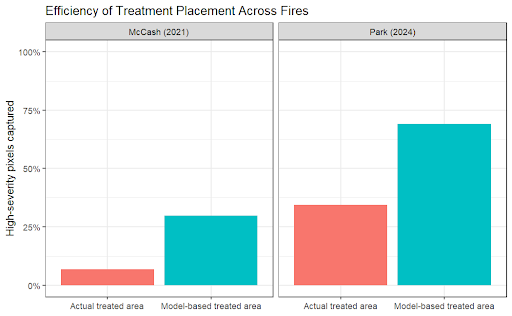

# Addressing Recent Spikes of Severity of Wildfires in Northern California With Data Analysis and Machine Learning

## Project Overview
Wildfires in northern California are increasing in severity due to climate change and long-term fuel accumulation. However, current fuel treatment strategies are often not aligned with the environmental conditions that drive high-severity fire.

This project develops a data-driven framework to improve wildfire mitigation by combining:
1) A spatial risk model to identify where high-severity fire is most likely 
2) A fire regime classification model to determine which treatments are most effective in different environments

Together, these approaches provide a scalable method for improving the efficiency and effectiveness of fuel treatment planning.

## Key Findings
- Wildfire severity is primarily driven by environmental conditions.
    - Fuel structure, vegetation type, and atmospheric dryness (VPD) strongly influence whether fires become high-severity.
- Current fuel treatment placement is inefficient.
    - Existing treatments are often misaligned with areas most likely to experience high-severity fire.
- A machine learning risk model improves targeting.
    - A Random Forest model identifies high-risk areas and captures a greater share of high-severity fire under the same treatment budget.
- Wildfire behavior clusters into distinct fire regimes.
    - Eleven regimes emerge from pre-fire environmental conditions, each requiring different management strategies.
- A combined, risk-based framework improves outcomes.
    - Integrating spatial risk (where) with regime-based treatments (how) increases effectiveness without increasing resources.

## Example Result

Figure 2. Comparison of treatment placement efficiency in capturing high-severity fire areas under observed and model-based strategies. Bar charts show the proportion of high-severity pixels intersected by actual treatment locations versus optimized, model-based treatment placement for two case studies: McCash (2021) and Park (2024). Across both fires, model-based treatment scenarios capture a substantially greater share of high-severity areas than existing treatments, highlighting the potential gains in effectiveness from strategically prioritizing treatment locations based on fire behavior and landscape conditions.

## Data Sources
* MTBS (Monitoring Trends in Burn Severity)
* CAL FIRE (California Department of Forestry and Fire Protection)
* LANDFIRE (Landscape Fire and Resource Management Planning Tools)
* PRISM (Parameter-elevation Regressions on Independent Slopes Model)

Raw data files are too big to be stored on GitHub, and can be found in [this Google Drive folder](https://drive.google.com/drive/folders/1ywLNy2Vk8i748Z1bfy3FXhVBVB3FLQhz?usp=sharing).

## Repository Structure

- `AnalysisDatasets/` - Datasets used for analysis and modeling, created by the 4 data sources through python files
- `Figures/` - Output figures used in the white paper 
- `Python Code (joining source data)/` - Python scripts to join data from our 4 sources to create datasets for analysis and modeling
- `R Code (analysis)/` - Rmd file to perform data processing, analysis, modeling, and visualization 
- `White Paper/` - Final white paper document  
- `README.md` - Project overview and documentation 
- `.gitignore` - Ignoring large source datasets and Mac files

## White Paper
Read the full report here:  
[Addressing Recent Spikes of Severity of Wildfires in Northern California with Data Analysis and Machine Learning](https://drive.google.com/file/d/1yda1wmDHoDYFRi5STZioqhLbWhNmdYv6/view?usp=drive_link)

This paper presents a data-driven framework combining spatial risk modeling and fire regime classification to improve wildfire fuel treatment placement and effectiveness.

## Author Contributions

- **Jenna Hopkins** - Joining source data, hypothesis testing, supervised modeling, solutions and recommendations
- **Jerrick Little** - Stakeholder and policy research, EDA, hypothesis testing, problem description and recommendations
- **AJ Tennathur** - Data processing, EDA, unsupervised learning, executive summary and background

All authors contributed in some way to subject research, data gathering, analysis, and modeling, and writing the white paper.
